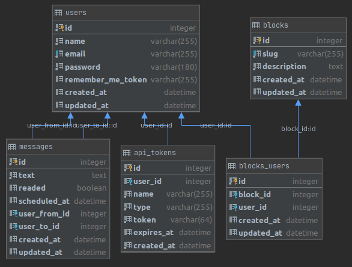

# Atados

Resolução do desafio.

- Linguagem escolhida: [**TypeScript**](https://www.typescriptlang.org/);
  - **Porque**: principalmente devido a escolha do framework. Adonis.JS 5 é escrito em TypeScript.
- Framework back-end: [**Adonis.JS 5**](https://preview.adonisjs.com/);
  - **Porque**: dos frameworks para back-end nas linguagens JavaScript e TypeScript, Adonis.JS foi o que mais me cativou, principalmente por seguir os padrões adotados pelos outros frameworks que já tive mais contato (como Laravel para a linguagem PHP).
- Banco de dados: [**SQLite**](https://www.sqlite.org/index.html).
  - **Porque**: utilizo SQLite para aplicações mais simples, como foi o caso desse desafio. Para aplicações mais robustas, normalmente utilizo PostgresSQL.

----------

## API
Estando na pasta raiz do projeto:

```bash
# Instalar dependências
npm install

# Variáves de ambiente
cp .env.example .env
## Altere no arquivo .env as variáveis desejaveis de ambiente.
## Eu alterei o .env.example para ficar do mesmo jeito que estava usando na minha máquina

# Compilar
node ace serve
## Após compilar, aperte: Ctrl+C

# Crie a chave da api
node ace generate:key

# Crie a pasta que conterá o banco de dados sqlite
mkdir tmp

# Criando as tabelas no banco de dados
node ace migration:run

# Povoando o banco de dados
node ace db:seed --files=BlockSeeder

# Ativando o servidor
node ace serve
## Espera-se que a api estará ativa no endereço 127.0.0.1:3333 
```

----------

## Testes
Os testes foram nomeados de acordo com as história descritas, sendo elas:

- Implementar criação de usuários com os campos email, nome e senha
- Como usuário eu devo conseguir gerar um token de acesso com uma combinação de email e senha
- Implementar hash de senha
- Como usuário eu devo conseguir me registrar somente se meu email não estiver registrado
- Como usuário eu devo conseguir enviar uma mensagem para outro usuário
- Como usuário eu devo conseguir agendar o envio de uma mensagem
- Como usuário eu devo conseguir enviar uma mensagem somente se estiver autorizado
- Como usuário eu devo conseguir deletar os mensagens enviadas por mim
- Como usuário eu não devo ter acesso para deletar mensagens que não foram criados por mim
- Como usuário eu devo conseguir marcar uma mensagem como lido
- Como usuário eu devo conseguir filtrar as mensagens por lido ou não

Para os testes funcionarem, é preciso ativar o servidor.

```bash
# Ativa o servidor
node ace serve
## Após isso, abra outro terminal para executar o comando de testes

# Executa todos os testes
node build/japaFile.js
```

----------

## Rotas

Foram criados um total de 10 rotas, sendo elas:
- Auth
  - Registrar: `[POST] /auth/register`
  - Login: `[POST] /auth/login`
  - Logout: `[GET] /auth/logout`
- Messages
  - Listar: `[GET] /messages`
  - Registrar: `[POST] /messages`
  - Marcar como lida: `[PUT] /messages/:id`
  - Apagar: `[DELETE] /messages/:id`
- Blocks
  - Listar: `[GET] /block_user`
  - Registrar: `[POST] /block_user`
  - Apagar: `[DELETE] /block_user/:id`

Em anexo a esse documento, está um arquivo do [Insomnia](doc/Insomnia_Atados.json) com todas as rotas criadas e exemplos de requisições.

----------

## Banco de dados
Optou-se por usar o banco de dados SQLite, mas a mudança de banco de dados da aplicação não é difícil, pois utiliza-se os meios para tal que o framework já possui.

Para esse documento, foram ignoradas as tabelas criadas automaticamente pelo Adonis.JS e SQLite.



Foram criadas um total de 5 tabelas:

- **users**: contêm os dados dos usuários;
- **api_tokens**: para o gerenciamento dos tokens da API;
- **messages**: mensagens enviadas entre os usuários;
- **blocks**: bloqueios presentes no sistema. É alimentado por um seed no servidor;
- **blocks_users**: relaciona usuários e bloqueios.

Para trabalhos futuros:
- Implementar _soft delete_ nas tabelas desejadas;
